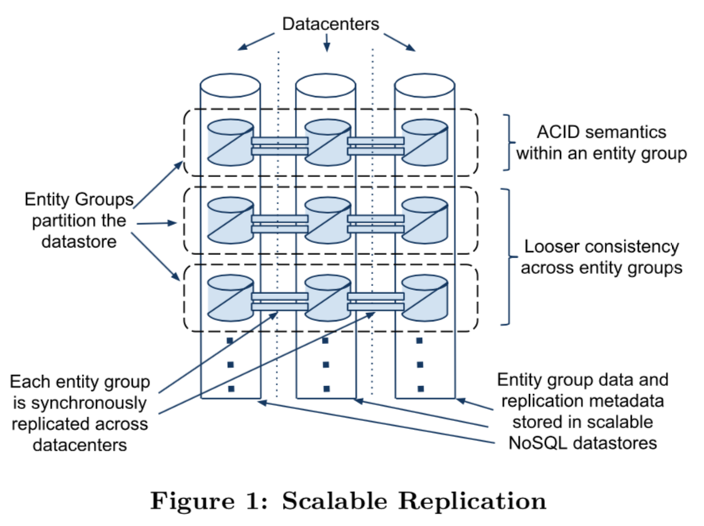
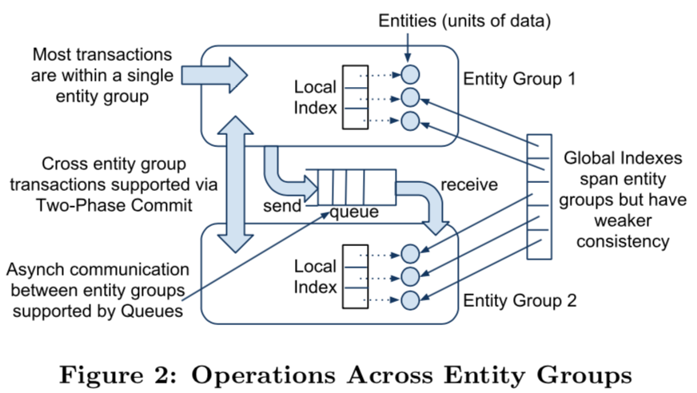
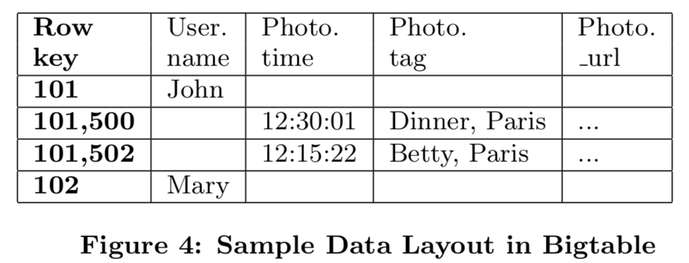

### Megastore概述
Megastore概述是谷歌开发的满足在线交互服务需求的数据存储系统。其期望满足的需求如下：
1. highly scalable.
2. low latency.
3. highly available.
4. user consistent view of the data.

在传统的Relational databases提供了丰富而方便的数据库接口，但是在扩展性方面欠缺； NoSQL databases有很好的扩展性，但是接口很受限，并且一致性模型比较松散。Megastore是二者的折衷，结合NoSQL的可扩展和RDBMS的便利，使用同步副本(synchronous replication)来获取高可用和数据一致性视角，简言之，Megastore使用ACID语义的远距离多副本同步，同时做到足够低的时延，支持在线交互业务。

做法大概是：
1. 数据分区，每个分区独立做副本管理；
2. 对一个分区内部支持足够的ACID语义，但是分区之间只保证有限的一致性；
3. 提供传统数据库的二级索引，但是只对用户可以忍受的时延限制做扩展，也只支持部分分区scheme。

作者假设用户场景数据是由用户可以做好数据分区的。

论文最核心的有三点：
1. 数据模型(data model)和存储系统(storage system)的设计，支持高可用和可扩展交互式应用的快速开发；
2. Paxos副本和一致性算法实现针对低时延操作的优化实现，充分利用跨地域的分布式数据中心提供高可用；
3. Megasotre大规模部署的经验。

### 高可用和可扩展的设计
设计思路：
1. 高可用，实现了针对长距离链接的同步、容错的log replicator；
2. 可扩展，把数据划分为若个小数据库，每个有独立的replicated log，存储在pre-replica NoSQL datastore。

#### Replication
实现多副本很重要。介绍实现多副本的策略和引进Paxos。

##### 策略
通常有3种多副本策略：
1. 异步Master/Slave ： Master分发write-ahead log entries给至少一个slave，在分发的同时Master给外界返回ACK表示写入成功，支持ACID的事务操作，但是有丢数据的风险，做一致性需要有master的身份；
2. 同步Master/Slave ：Master需要等待Slaves返回ACK才确认写成功，不会丢数据，但是Master和Slave的失败需要外界系统定时探测；
3. 乐观副本：任何replica group都是同等身份接收写入，然后再异步相互提交。这种策略可用性和时延都很优秀的，但是没有时序，做不了事务。

丢数据不可接受；不支持ACID事务的策略也不可接受；重型唯一的Master的方案也不接受，因为容错和恢复的复杂性很高。需要做一个任一Master容错的、易恢复的系统。

##### 考虑Paxos
Paxos，一个已经被证明了的、最优的、容错的一致性协议，并且不需要引入独特的master机制。
1. 通过Paxos算法，各个节点都是对等的，不存在统一的、独特的master做管理，减少了master单点错误状态处理；
2. 同时因为各个节点都是对等的，所以Write-Ahead-Log机制各个节点都复制一份log，这能够提升容错，但是对于大区域的业务而言，通信latency的需求限制了整体的吞吐；
3. 为了保证数据可靠，往往都需要达到多数派才能够ack写入ok；在传统数据库中，使用的是单master管理很多节点，同步写入多数派数据来保证写入成功；
4. 所以，为了使用多份副本写入，需要通过每个Group管理自己一部分数据集来达到提升可用性和吞吐。

#### 分区和区域化
为了扩展副本schema和最大化底层数据存储的性能，设计了由用户设定的数据分区和区域化控制策略。

##### Entity Groups
为了扩展吞吐和区域优势，我们把数据切分为`entity groups`集合，每个`entity group`是一个在广域范围内独立和同步的副本复制单位。底层数据存储在每个数据中心的可扩展的NoSQL数据库中。每个`entity group`提供单阶段的ACID事务操作（内部支持Paxos副本复制）。

跨`entity group`支持性能差得两段提交事务，但是Megastore提供了高效的异步消息机制。

注意，此处说到的跨`entity group`是指逻辑距离，不是物理距离。可以做到跨数据中心都是`entity group`内部的log复制，跨`entity group`是在同一个数据中心内部实现的。

##### 选`entity group`边界
`entity group`是需要快速操作的数据组，选好`entity group`边界很重要，当放太多无关数据到一个`entity group`会减少有效数据的吞吐，但是有关数据放在不同`entity group`又会增大跨`entity group`的开销。论文举了几个例子，分别是邮件、博客、地图等。

##### 物理布局
`Megastore`使用`Bigtable`作为单数据中心的可扩展、高容错的存储，允许支持跨多行的任意读写吞吐。为了最小化latency和最大化吞吐，允许应用自己控制数据分布——通过选择Bigtable实例和指定实例区域。为了低lantecy，应用保证用户和副本靠近，分配`entity group`到最多被获取的区域。每个`entity group`持有连续的key range，利用cache的数据，降低latency和提升吞吐。schema语言还允许控制层级数据的位置。

#### `Megastore实现`
##### API设计哲学
ACID追求正确性，而往往同等重要的还有性能。`Megastore`追求易懂的API，通过运行时消耗来匹配用户的指令。

常规的关系型schame依赖于join来给用户提供服务，因为以下几个原因，这个模型并不适合`Megastore`：
1. 对于高交互的工作负载来说，数据预取性能比query 语言明确表达带来的收益更大；
2. 针对我们目标用户而言，读比写场景多很多；
3. 存储和查询层级数据是作为kv存储的（底层使用bigtable）；

因为这些原因，我们设计一个数据模型和schema语言去提供细粒度的物理区域的指定控制。

##### 数据模型
`Megastore`支持介于RDBMS和NoSQL的数据模型。
1. 针对RDBMS，数据模型被定义在schema并且是强类型。每个schema有一组表，每个表包含若干`entities`，拥有着一组属性，属性有属性名和类型。类型可以是`strings`、`numbers`、`Google's Protocol Buffers`，可以是`required`、`optional`、`repeated`。一个表的所有`entities`可以指定entity的`primary key`，在表格内是唯一的。
```
CREATE SCHEMA PhotoApp;
CREATE TABLE User {
    required int64 user_id; 
    required string name;
} PRIMARY KEY(user_id), ENTITY GROUP ROOT;

CREATE TABLE Photo {
    required int64 user_id; 
    required int32 photo_id; 
    required int64 time;
    required string full_url; 
    optional string thumbnail_url; 
    repeated string tag;
} PRIMARY KEY(user_id, photo_id),

IN TABLE User,
ENTITY GROUP KEY(user_id) REFERENCES User;
CREATE LOCAL INDEX PhotosByTime
  ON Photo(user_id, time);
CREATE GLOBAL INDEX PhotosByTag
  ON Photo(tag) STORING (thumbnail_url);
```
`Megastore`表格包含root tables和child tables。每个child table必须定义有`foreign key`引用到root table，如上例子的`ENTITY GROUP KEY(user_id) REFERENCES User`的`user_id`。

##### 带key的预join
每个entity映射到bigtable的同一行，primary key作为这一行的row_key，剩余的属性作为其余的列。

##### 索引
二级索引可以定义在任何entity属性的list中。我们区分两种类型的索引：local和global。一个local索引被作为每个`entity group`的独立索引，global索引是多个`entity groups`的索引。`Megastore`还提供有额外的索引特性：

###### STORING条目
通过索引获取数据通常有两个步骤：
1. 读索引去匹配primary key；
2. 使用primary key去fetch entities。
我们通过增加STORING字段，应用端从primary table中存储额外的属性，可以减少读primary key的时间。

###### Repeated Indexes
对于repeated类型属性提供索引。

###### Inline Indexes
内置索引提供了对非常规数据转化为关联entity的方法：index entities在target entry作为virtual repeated column。这个特性对从child entities抽取信息分片和数据存储parent中快速获取的场景很有帮助。

##### `Megastore`映射到`Bigtable`
把`tablename.property`作为`Bigtable`的列名，可以做到让`Megastore`的多个表映射到`Bigtable`的同一行。

同样，把root entity映射到`Bigtable`的一行，利用单行事务可以实现`Megastore`层面的事务。

#### 事务和并发
每个`Megastore`的`entity group`都如同mini database一样提供序列化ACID的原语。一个事务先写入`entity group`的`write-head log`，然后再做数据变更。

`Bigtable`提供存储多个同样row/column带有不同时间戳的value，利用这个特性实现多版本并发控制（multiversion concurrency control）：当带事务的写提交应用时（意思是写完log之后），事务操作的写是带有时间戳写入的。此时，读这次事务之前的版本可以避免看到部分更新的情况。读和写不相互阻塞，并且在事务期间读独立于写。

`Megastore`提供current、snapshot、inconsistent读。current和snapshot读是针对单一`entity group`范围的。而写操作总是起始于current读的下一个log position，commit操作把写操作提交到log entry，并且分配比之前大的时间戳，最后通过Paxos把写操作添加到log日志文件中。

完整的事务生命周期是：
1. 读：拥有时间戳和最后commit事务的log position；
2. 应用逻辑：从`Bigtable`读取数据，把写数据聚合写入log entry；
3. 提交：使用Paxos添加数据到log，一致性保证；
4. 应用：写数据到`Bigtable`上的entities和indexs；
5. 清理：删除不再需要的数据。

##### 队列
对于跨`entity groups`情况，`Megastore`提供事务消息队列支持。

##### 两阶段提交
`Megastore`为跨`entity groups`的原子更新提供两阶段提交机制。

#### 其他特性
全文本索引，同步复制，加密。。。

### 副本
本节叙述同步副本schema的核心——低latency的Paxos实现。

#### 整体介绍
`Megastore`副本系统提供一个单一的、数据一致性视角，数据存储在底层的副本中。读和写可以在任何副本发起，事务原语不用管副本client处于哪个状态。每个`entity group`的副本同步复制group的事务log。通常写要求一轮数据中心的交互，正常读一般本地可读完成，current读提供两个保证：
1. 读总能看到最后确认的写；
2. 在写被看到后，未来的所有读都能看到这个写（一个写可能在它完成前被看到）。

#### Paxos简介
Paxos算法是就一个值在一个group的多个副本机上达到一致性的方法。它会有延时或乱序，也会因副本机stop而失败。算法要正常运行，大多数副本机必须是可用的并且可到达的，对于2F+1个副本机，允许F个失败。一旦这个value被大多数选中，所有的未来尝试去读或者写都能够达到同样的输出。数据库通常使用Paxos算法复制一个事务log，新value写入最新的选中位置。

原始的Paxos论文因为要求多轮通信而导致高latency，为了达到一个值，写请求至少副本机之间至少两轮交互：一轮prepares和一轮accepts。读要求至少一轮prepares去确定最后选中的value。工程实现时可做些简化。

#### 基于Master的方法
为了最小化latency，很多系统使用一个总控master，经过所有的读写请求。因为master会经过所有的写请求，所以master的状态一定是最新的，并且可以提供不需要额外网络通信的一致性读。写也得以简化为一个prepares的回调确认accpect。master可以batch写请求提升吞吐。

对于读写灵活性受到master的限制。事务处理必须在相邻master副本机之间完成，否则会出现串行读的累计latency；任何潜在的master副本机必须为全负载拥有充足的资源；slave副本机在正式成为master前都是浪费的；master错误恢复要求复杂的状态机转换，需要一定时间做服务恢复，做不到用户无感。

#### `Megastore`的方法
本节讨论Paxos的工程优化。

##### fast reads
